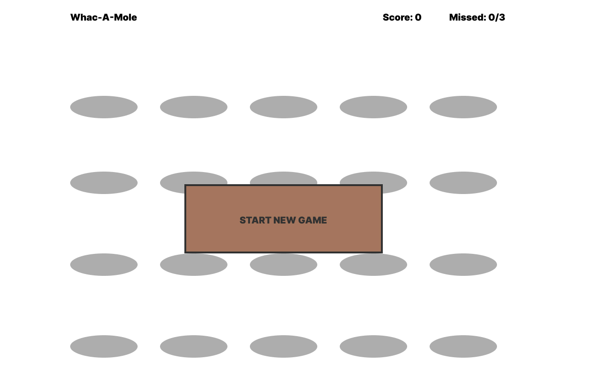
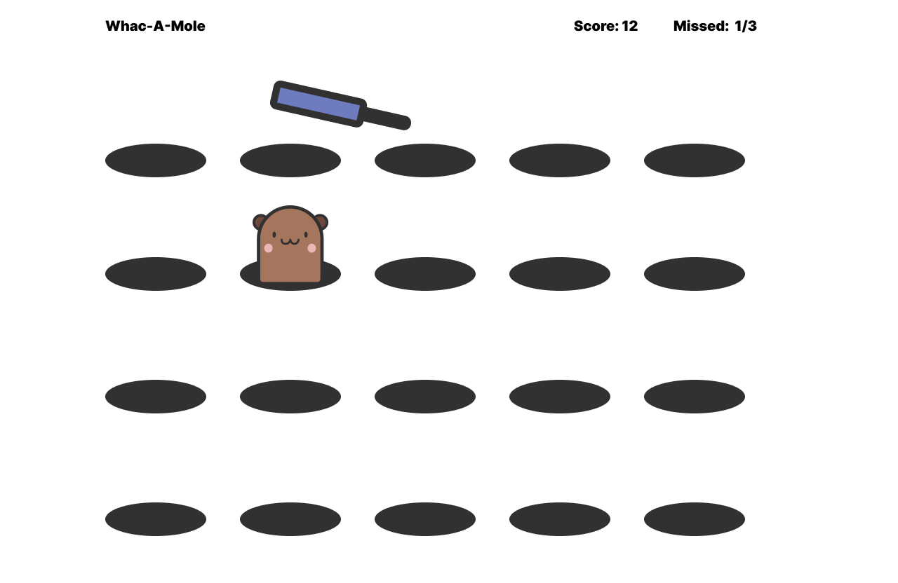
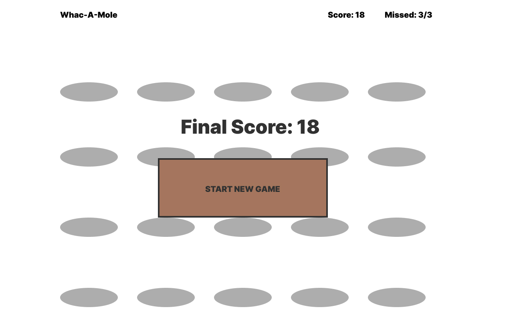

# Mob Programming Session - Whac-A-Mole

## Goal

Create a small browser game of Whac-A-Mole.

## Acceptance Criteria

1. Player can start a new Whac-A-Mole game.
2. Each time a player hits a mole, he scores 1 point.
3. A game ends when the player missed 3 moles.
4. Optional: A player can see his best scores on a score board.

## UX Layouts

### New Game

### Gameplay

### Game End

